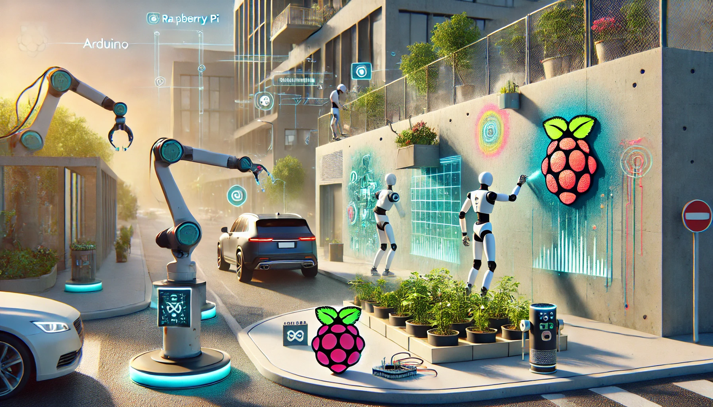

# "Καλαίσθητοι εξωτερικοί χώροι"

Παρακάτω περιγράφεται η πρόταση έργου για την συμμετοχή της ομάδας μας , "Art and Sciense", στον «7ο Πανελλήνιο Διαγωνισμό Ανοιχτών Τεχνολογιών στην Εκπαίδευση»

**Ομάδα:  "art_and_sciense"** Μαθητές Γυμνασίου & Λ.Τ Ακραιφνίου 

**Τίτλος έργου:** «Καλαίσθητοι εξωτερικοί χώροι »

___

___

# Α. Γενική Περιγραφή της ιδέας 

Στο έργο αυτό προτείνουμε την κατασκευή ενός συστήματος διαχείρισης εξωτερικών χώρων

---

>  * Σημείωση : Οι παραπάνω εικόνες έχουν παραχθεί με  τεχνητή νοημοσύνη ,   και  προσπαθούν να απεικονίζουν σφαιρικά  και όχι με ιδιαίτερες λεπτομέρειες την κεντρική ιδέα του προτεινόμενου έργου  (δίνεται έμφαση στο αποτέλεσμα και την περιγραφή του ) .   Προφανώς τεχνικά δεν είναι ακριβής και δεν αποτελούν   την απεικόνιση του τελικού παραδοτέου έργου *
---

Στην καθημερινότητά μας , είμαστε όλοι οι χρήστες κοινόχρηστων εξωτερικών χώρων. Οι χώροι αυτοί ,  είτε είναι απλώς μέρος της καθημερινής μας διαδρομής είτε  τους χρειαζόμαστε και κάνουμε χρήση κάποιων υπηρεσιών που πηγάζουν από αυτούς . Ιδιοκτησιακά αυτοί ανήκουν είτε στους δήμους , είτε στην περιφέρεια είτε στην πολιτεία γενικότερα.

Παρατηρώντας γύρω μας πιο μεθοδικά, θα δούμε ότι  οι χώροι αυτοί είναι είτε χωρίς κανένα κεντρικό έλεγχο και ημί-παρατημένοι , είτε εντελώς παρατημένοι και ξεχασμένοι. Το αποτέλεσμα είναι όμως , πάντα,  ότι αισθητικά δίνουν μία εικόνα εγκατάλειψης  και  ψυχολογικά φορτίζουν αρνητικά τον  επισκέπτη ή τον περαστικό. 

Θα μπορούσαμε να πούμε ότι στην καλύτερη περίπτωση περνούν αδιάφοροι ενώ στην χειρότερη είναι  μια θλιβερή έως παρακμιακή νότα στην καθημερινότητα του πολίτη. Σίγουρα όμως δεν αποπνέουν την αίσθηση ενεργητικότητας , δημιουργικότητας και καινοτομίας , αίσθηση που διαχρονικά αλληλοεπάγεται από τον πολίτη στο κοινωνικό σύνολο και αντίστροφα.

Πέρα από την παραπάνω αισθητική προσέγγιση, λειτουργικά θα μπορούσαμε να παρατηρήσουμε ότι  σε τέτοιους κοινόχρηστους χώρους γίνεται συνήθως κατασπατάληση φυσικών πόρων (νερό, ενέργεια, υλικών , .....)

Το σύστημα που προτείνουμε καλείται να διαχειριστεί μικρούς εξωτερικούς κοινόχρηστους χώρους, ενοποιώντας την διαχείρισή τους. Οι προτεινόμενες  παρεμβάσεις κινούνται κυρίως σε δύο άξονες , πιο συγκεκριμένα, λειτουργικότητα  και αισθητική βελτίωση των χώρων αυτών .

-  **Λειτουργικότητα** : 

    - Κεντρική διαχείριση , καταγραφή και έλεγχος διάσπαρτων χώρων
    - Παρακολούθηση  λειτουργικών παραμέτρων ( αισθητήρες, ενεργοποιητές)
    - Παρακολούθηση καταναλώσεων (νερού,φωτισμού, ενέργειας ,κ.τ.λ)

-  **Καλλωπισμός-Αισθητική βελτίωση** :

    - Ζωγραφιές και καλλιτεχνικές απεικονίσεις επί των τοίχων,
    - Ρομπότ που  ζωγραφίζει στους τοίχους
    - Φροντίδα χώρων πρασίνου

<!---->

Το σύστημά μας θα υλοποιηθεί  με  ανοιχτό και ελεύθερο λογισμικό και υλικό , το οποίο θα μπορούμε να διαχειριστούμε τοπικά καθώς και από το διαδίκτυο.

Συνεπώς το σύστημά μας δεν θα είναι δεσμευμένο και εξαρτώμενο από εξωτερικές υπηρεσίες καθώς επίσης θα είναι  πλήρως επεκτάσιμο.

---

# Τι παρόμοιο υπάρχει - Τρέχουσα αντιμετώπιση προβλήματος

Στην προσπάθειά μας να ερευνήσουμε την τρέχουσα κατάσταση και να παρατηρήσουμε τι λύσεις υπάρχουν σε παρόμοια προβλήματα καταλήξαμε στις παρακάτω διαπιστώσεις:

-  **Λύσεις Λειτουργικότητας** : 

    - Υπάρχουν αρκετές λύσεις για "Παρακολούθηση-έλεγχο" (SCADA συστήματαα) . 
    - Τα περισσότερα από αυτά  βασίζονται σε **κλειστές εταιρικές λύσεις** και μάλιστα **ιδιαίτερα ακριβές**.
    - Ο χρήστης τους είναι εγκλωβισμένος στην χρήση μόνο συστημάτων της "Εταιρείας-Λύσης", που θα επιλέξει, χωρίς να μπορεί να  συνδυάσει τα καλά διαφόρων συστημάτων.
    - Επίσης πάντα οι προτεινόμενες λύσεις **δεν μπορούν να προσαρμοστούν** απόλυτα στις ανάγκες ελέγχου  που θα θέλαμε εμείς και ούτε  να μας δώσουν τη δυνατότητα προγραμματισμού εκ μέρους μας.

-  **Λύσεις Καλλωπισμού-Αισθητικής βελτίωσης** : 

    - **ΔΕΝ Υπάρχουν** καθόλου λύσεις για "Καλλωπισμό-Αισθητική βελτίωση" 
    - Επίσης **ΔΕΝ Υπάρχει** σύστημα κεντρικής διαχείρισης καλλιτεχνικών παρεμβάσεων (κάτι σαν βιβλιοθήκη υλοποιημένων και προτεινόμενων παρεμβάσεων )
    - Τέλος **ΔΕΝ Υπάρχει** αυτοματοποίηση στο πεδίο αυτό (π.χ  ένα Ρομπότ που να ζωγραφίζει στους τοίχους)  

Προφανώς η δική μας λύση είναι σε διαφορετική κατεύθυνση. Υιοθετώντας ανοιχτές τεχνολογίες και πλήρη έλεγχο στον προγραμματισμό και στην ανάπτυξη της πλατφόρμας έχουμε την πλήρη ελευθερία , ιδιωτικότητα και έλεγχο , που είναι και τα ζητούμενα. 

# Αναγκαιότητα του Έργου - Στόχοι

Σύμφωνα με την ανάλυση των δεδομένων που παρουσιάστηκαν στην προηγούμενη παράγραφο, προέκυψε η ιδέα και η πρόταση για το παρόν σύστημα.

Πιο συγκεκριμένα το σύστημα που προτείνουμε έχει τα παρακάτω χαρακτηριστικά τα οποία προσπαθούν να λύσουν τα προβλήματα που προέκυψαν κατά την έρευνά μας. Τα προτεινόμενα και επιθυμητά χαρακτηριστικά είναι τα εξής:

 - Να ακολουθεί ανοικτά πρότυπα
 - Να είναι επεκτάσιμο 
 - Να μπορεί να διασυνδέει υπάρχοντα συστήματα
 - Να δίνει την δυνατότητα προγραμματισμού στον χρήστη
 - Να συντελεί στην δημιουργία προτύπου για πειραματισμό
 - Την δημιουργία πειραματικής υποδομής για μελλοντική χρήση τόσο στο σχολείο όσο και αλλού
 - Να αποσκοπεί στην  ενοποίηση τέχνης και επιστήμης
 - Να αξιοποιεί τις δεξιότητες όλων των μελών της ομάδας
 - Να θέτει ως προτεραιότητα την καλαισθησία των χώρων
 - Να εξοικειώνει με την εξοικονόμηση ενέργειας και φυσικών πόρων
 - Να προωθεί την δημιουργία χώρων πρασίνου

 
---

# Β.  Δομή - Χρήση- Υλοποίηση του συστήματος

---

Το σύστημα περιλαμβάνει τα ακόλουθα μέρη:

# Βασικά μέρη του συστήματος
Τα βασικά μέρη του συστήματος μας περιγράφεται παρακάτω 

<!---->

## 1. Κεντρικός server του συστήματος 

Στο κέντρο του συστήματος θα υπάρχει ο εξυπηρετητής (server) υλοποιημένος σε ένα raspberry pi . 
Στον server αυτό θα εγκαταστήσουμε ανοικτό λογισμικό το οποίο θα εκτελεί όλες τις διαδικασίες του συστήματος.

Συγκεκριμένα θα μπορεί να :
* Επικοινωνεί με τους Τοπικούς Ελεγκτές Χώρων
* Διατηρεί βιβλιοθήκη γραφικών για τα Ρομπότ-Ζωγράφους 
* Παροχή web interface για τον χρήστη
* Απεικόνιση μεγεθών αισθητήρων (ανά χώρο)
* Εκτέλεση εντολών στους ενεργοποιητές (ανά χώρο)
* κ.τ.λ

## 2. Τοπικός Ελεγκτής Χώρου 

Βασική θέση στο σύστημα μας , θα έχει   ο Τοπικός Ελεγκτής Χώρου, ο οποίος θα είναι ένας ανά κοινόχρηστο χώρο. Το έργο του είναι τόσο η επικοινωνία με τον κεντρικό server για καθοδήγηση και παρακολούθηση όσο και ο έλεγχος των **Σημείων ελέγχου (βλέπε 4)**  όσο και  του **Ρομπότ-Ζωγράφου (βλέπε 3)** .

Πιο συγκεκριμένα η  συσκευή αυτή θα αποτελείται από :

* Κατασκευή  κατάλληλου κουτιού φιλοξενίας
* Μικροεπεξεργαστή τοπικού ελέγχου με wi-fi επικοινωνία
* Πρωτόκολλο Αμφίδρομης επικοινωνία με  τον κεντρικό server 
* Παρακολούθηση των Σημείων ελέγχου (μόνο του χώρου του)
* Έλεγχος- Αρχικοποίηση του Ρομπότ-Ζωγράφου (μόνο του χώρου του)

## 3.Ρομπότ-Ζωγράφος

Αυτή η συσκευή θα μπορεί να  αρχικοποιείται με την " ζωγραφιά - γραφικό απεικόνισης" από τον τοπικό ελεγκτή χώρου την οποία θα καλείται να ζωγραφίσει σε κάθετους τοίχους.

Ειδικότερα θα μπορεί να :

* Αρχικοποιείται με την " ζωγραφιά απεικόνισης" από τον τοπικό ελεγκτή 
* Επικοινωνεί μέσω  wi-fi
* Ζωγραφίσει σε κάθετους τοίχους
* Να δέχεται κατάλληλες εντολές

## 4.Σημεία ελέγχου (Ελεγχόμενες Συσκευές-Αισθητήρες) 

Το σενάριο λειτουργίας κάθε χώρου θα υλοποιείται απο τις ελεγχόμενες συσκευές. Στις συσκευές αυτές θα μπορούν να συμπεριληφθούν  εμπορικές συσκευές καθώς και δικές μας ιδιοκατασκευές.
 
 Αναλυτικότερα θα μπορούν να είναι :
* Αισθητήρες θερμοκρασίας και υγρασίας
* Αντλίες ποτίσματος
* Μετρητές κατανάλωσης ενέργειας (ή νερού)
* Πρίζες ελεγχόμενες με επικοινωνία wi-fi
* Φωτιστικά και λεντοταινίες
* Συσκευές Σήμανσης και ανακοινώσεων (π.χ Ηχεία, Σειρήνα, Φωτεινή Σήμανση)
* κ.τ.λ

>  * Σημείωση : Στο έργο δεν θα συμπεριλάβουμε όλες τις παραπάνω Ελεγχόμενες Συσκευές, αλλά μόνο θα προδιαγράψουμε τον τρόπο ελέγχου και επικοινωνίας *

## 5.**Δικτυακή Υποδομή** : 

Όπως ήδη αναφέραμε ο κεντρικός σταθμός του συστήματος θα συνδέεται στο τοπικό δίκτυο του σχολείου. Η προσπάθειά μας θα είναι να τοποθετηθεί σε μέρος το οποίο να είναι κοντά σε κάποιο Ethernet network switch έτσι ώστε να μπορεί να συνδεθεί με τους χρήστες . Επίσης δεν έχουμε προδιαγράψει κάποιον πρόσθετο δικτυακό εξοπλισμό έτσι ώστε να κάνουμε **ελαχιστοποίηση του κόστους του συστήματος**

---

# Κύρια Χαρακτηριστικά

---
 - Στο Hardware  και στο software θα γίνεται χρήση αποκλειστικά **ανοιχτών τεχνολογιών  και ανοιχτού λογισμικού** (Raspberry Pi, ESP32, Arduino, App Inventor, Python, Home Assistant , Node Red,  κτλ)

 - Το όλο σύστημα  στα σχεδιαστεί  έτσι ώστε να παρέχεται   η μέγιστη **επεκτασιμότητα**  και θα ακολουθεί λογική **αρθρωτού  σχεδιασμoύ**.

 - Η αυτοματοποίηση  θα μπορεί  να επεκταθεί σε οποιοδήποτε **αριθμό αισθητήρων και συσκευών** 

 - Ο κεντρικός σταθμός θα αρχειοθετεί και θα οργανώνει  **" συνταγές και σενάρια χρήσης"**  τις οποίες θα ενεργοποιεί και θα αποστέλλει  κατά τη βούληση του χειριστή

---

# Υλικά - Λίστα υλικών - Κόστος

---

Το σύστημα που προτείνεται είναι αρθρωτό και μπορεί να υλοποιηθεί με κλιμακούμενες διαμορφώσεις. Το προϋπολογιζόμενο  **κόστος είναι 387**, στο προτεινόμενο  πλήρες σύστημα

ΥΚΙΚΑ

* 1 τεμ. Χ  3D Νήμα PLA 1.75mm  1kg

* 2 τεμ. Χ  Speaker - 3" Diameter - 4 Ohm  , 3 Watt

* 2 τεμ. Χ  Stereo Enclosed Speaker -8 Ohm , 3 W 
* 1 τεμ. Χ  Raspberry Pi Zero 2 W kit
* 1 τεμ. Χ  Raspberry Pi 5 8GB kit
* 1 τεμ. Χ  Addressable LED Strip WS2812
* 2 τεμ. Χ  ESP32 Development Board - DEVKIT V1
* 2 τεμ. Χ  I2S MEMS Microphone Breakout
* 2 τεμ. Χ  I2S 3W Class D Amplifier Breakout - MAX98357A
* 2 τεμ. Χ  Πλακέτα Δοκιμών (Breadboard)
* 2 τεμ. Χ  Jumper Cables, Dupont Terminal SET
* 2 τεμ. Χ  Μπαταρία Λιθίου 18650 3.6V - 2600mAh + Μπαταριοθήκη
*  Διάφορα μικροηλεκτρονικά εξαρτήματα
*  Καλώδια,βίδες, κτλ"

Αναλυτικότερα το κόστος και τα υλικά :

και μπορεί να βρεθει στο παρακάτω αρχείο 	
[Αναλυτικά Υλικά και κόστος Συστήματος](/kostos.pdf)

---

# Κατασκευή

---

# Μελλοντικές επεκτάσεις

---

# Κοινωνική επίδραση

Πολλές και ποικίλες είναι σίγουρα οι κοινωνικές επιδράσεις  του συστήματός που προτείνεται. Τις πιο βασικές παραθέτουμε παρακάτω :

 -  Βελτιώνει την ποιότητα ζωής των κατοίκων

 -  Δίνει  χώρο στην τέχνη και στις καλλιτεχνικές δεξιότητες να εκφραστούν

 -  Δείχνει πως να συμβιώνουν πρακτικότητα , λειτουργικότητα, καλαισθησία και τέχνη

 -  Κάνει προτεραιότητα την ψυχολογική ισορροπία και υγεία των πολιτών

 -  Δημιουργία πνεύματος και κλίματος έρευνας και δημιουργίας 

 -  Ενίσχυση  της χρήσης και αποδοχής ανοιχτών τεχνολογιών (με σκοπό την αντικατάσταση παρόμοιων κλειστών) 
 -  Κινητοποίηση καινοτομίας  και  παρόμοιων προτάσεων  από την ευρύτερη κοινωνία

-  Ενίσχυση και υποβοήθηση προσωπικών ικανοτήτων και δεξιοτήτων των μαθητών 

-  Κινητροδότηση  των μαθητών για συμμετοχή σε ομαδικές  εργασίες

---
# Σύνδεσμοι - Αναφορές

Λίστα με βίντεο λειτουργίας και διαμόρφωσης (playlist) https://www.youtube.com/channel/UCWkN9GRcy-cdKsbBie1HwAw

Περιγραφή του έργου στη σελίδα του διαγωνισμού στο ΕΛΛΑΚ
<a href="https://openedtech.ellak.gr/" target="_blank">[https://openedtech.ellak.gr/](https://openedtech.ellak.gr/)</a>
