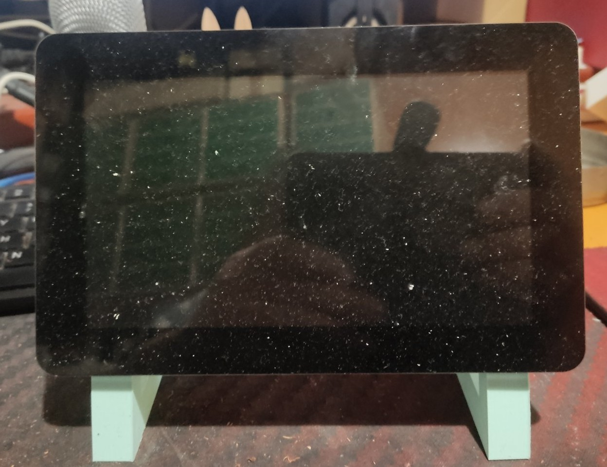
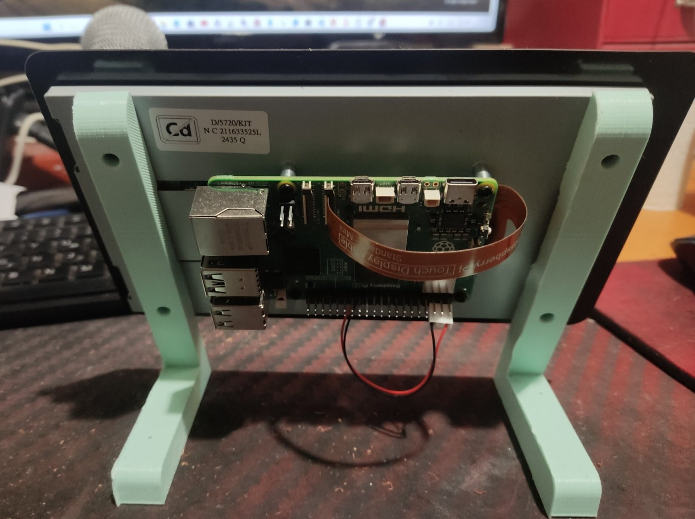
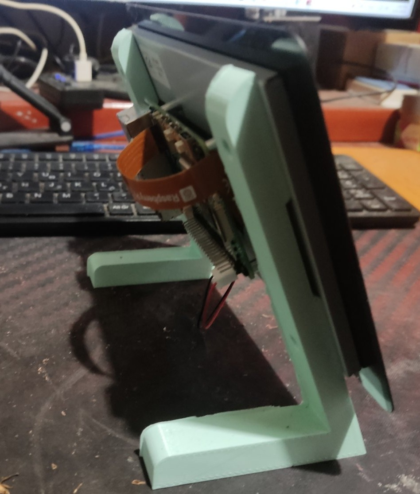

#  Κεντρικός Εξυπηρετητης-  τύπου kiosk ("Επίμονου περιηγητή") βασισμένου σε Raspberry Pi

Εμπρόσθια όψη 
<p align="center"></p>


Οπίσθια όψη
<p align="center"></p>


Πλάγια όψη
<p align="center"></p>

Στο έργο  μας αυτό  θέλαμε ο κεντρικός εξυπηρετητής να είναι αφοσιωμένος σε συγκερκιμμένη οθόνη (να τρέχει εξαρχής και σε πλήρη οθόνη λογισμικά  που θα ορίσουμε εμείς ).Οι παρακάτω οδηγίες έχουν ως αποτέλεσμα  την απλούστερη μορφή ενός "επίμονου" περιηγητή τύπου kiosk βασισμένου σε Raspberry Pi.

Οι διατάξεις τύπου kiosk είναι χρήσιμες όταν θέλουμε να δημιουργήσουμε έναν πίνακα ελέγχου  και να τον εμφανίζει το Pi ή να παίζει αυτόματα μία προσαρμοσμένη ιστοσελίδα ή ένα διαδικτυακό βίντεο κατά την εκκίνηση του Pi σε πλήρη οθόνη.


Για το δικό μας σύστημα Kiosk, χρησιμοποιήθηκε ο παρακάτω εξοπλισμός :

  - Raspberry Pi 5 
  - Raspberry Pi Touch Display 2
  - [Touch Display 2 3D Printed Stand](https://www.printables.com/model/1062445-raspberry-pi-touch-display-2-stand)

## Εγκατάσταση

Βεβαιωθείτε ότι χρησιμοποιείτε το Pi OS με γραφικό περιβάλλον (την 'πλήρη εγκατάσταση') και ότι είναι εγκατεστημένος ο Chromium (συνήθως είναι από προεπιλογή).

Στη συνέχεια, ανοίξτε το τερματικό και εγκαταστήστε τα προαπαιτούμενα:
```
sudo apt install unclutter
```

Δημιουργήστε το script που θα εκτελεί τον περιηγητή τύπου Kiosk:

```
mkdir -p /home/pi/kiosk
cp kiosk.sh /home/pi/kiosk/kiosk.sh
```

Αντιγράψτε το αρχείο μονάδας SystemD για να εκτελείται η υπηρεσία `kiosk`:

```
sudo cp kiosk.service /lib/systemd/system/kiosk.service
```

Ενεργοποιήστε την υπηρεσία `kiosk` στο Systemd ώστε να εκκινεί αυτόματα κατά την εκκίνηση του συστήματος:

```
sudo systemctl enable kiosk.service
```

(Προαιρετικά) Εκκινήστε αμέσως την υπηρεσία `kiosk`:

```
sudo systemctl start kiosk
```

## Rotating the Screen

Για να περιστρέψετε άμεσα την οθόνη αφής, μπορείτε να εκτελέσετε:

```
wlr-randr --output DSI-1 --transform 90
```

Αυτός ο προσανατολισμός θεωρεί ότι το Pi είναι τοποθετημένο έτσι ώστε το βύσμα USB-C να βλέπει προς τα κάτω στην οθόνη αφής. Αν η οθόνη είναι συνδεδεμένη στη θύρα DSI-2, αλλάξτε το `--output` ανάλογα.

Για να διατηρηθεί ο προσανατολισμός, ρυθμίστε την περιστροφή της οθόνης από το εργαλείο "Screen Configuration" ή επεξεργαστείτε το αρχείο ρυθμίσεων του `kanshi` στο `~/.config/kanshi/config`.

### Περιστροφή της οθόνης κατά την εκκίνηση (pre-GUI)

Μπορείτε επίσης να ορίσετε τον προσανατολισμό της οθόνης κατά την εκκίνηση (είτε στην οθόνη εκκίνησης είτε στην έξοδο της κονσόλας), επεξεργαζόμενοι το αρχείο `/boot/firmware/cmdline.txt`. Προσθέστε την παρακάτω παράμετρο πριν το τελευταίο όρισμα και κάντε επανεκκίνηση:

```
# Orientation options: normal, upside_down, left_side_up, right_side_up
video=DSI-1:panel_orientation=left_side_up
```

## Εξοικονόμηση ενέργειας

Καθώς το Kiosk είναι πιθανό να λειτουργεί συχνά (ή όλη μέρα), υπάρχουν μερικά πράγματα που μπορείτε να κάνετε για να μειώσετε την κατανάλωση ενέργειας:

### Μειώση της κατανάλωσης ενέργειας κατά την απενεργοποίηση κατά 140 Χ

ακολουθώντας τις οδηγίες  [guide in my blog post](https://www.jeffgeerling.com/blog/2023/reducing-raspberry-pi-5s-power-consumption-140x), αλλάξτε το EEPROM αρχείο (`sudo rpi-eeprom-config -e`) 
και ορίστε τις ακόλουθες ρυθμίσεις:

```
[all]
BOOT_UART=1
WAKE_ON_GPIO=0
POWER_OFF_ON_HALT=1
```

(Μην ανησυχείτε για την αλλαγή οποιωνδήποτε άλλων τιμών.) Αποθηκεύστε τις αλλαγές και περιμένετε να ενημερωθεί η EEPROM. Μόλις ενημερωθεί, η κατανάλωση ενέργειας του Pi 5 κατά την απενεργοποίηση θα είναι μικρότερη από 0,01W (με την προεπιλεγμένη διαμόρφωση του Pi, η κατανάλωση ενέργειας κατά την απενεργοποίηση μπορεί να φτάσει τα 1-2W!).

### Μείωση φωτεινότητας οθόνης όταν δεν χρησιμοποιείται

Το να λειτουργείς μια οθόνη πάντα ενεργοποιημένη με φωτεινότητα 100% όλη την ημέρα δεν είναι και τόσο χρήσιμο.


Μια λύση βρίσκεται στο : [Allow for screen to dim after a certain amount of time](https://github.com/geerlingguy/pi-kiosk/issues/2)

## Μηνύματα για Debugging

Μπορείτε να δείτε τα καταγεγραμμένα μηνύματα της υπηρεσίας `kiosk` εκτελώντας την εντολή:

```
journalctl -u kiosk
```

(Για ζωντανή παρακολούθηση των logs προσθέστε `-f` στην εντολή.)

## Διακοπή της υπηρεσίας

Με πρόσβαση μέσω SSH, μπορείτε να σταματήσετε την υπηρεσία με:

```
sudo systemctl stop kiosk
```

Διαφορετικά, αν έχετε φυσική πρόσβαση στο Pi και μπορείτε να συνδέσετε πληκτρολόγιο, πατήστε `Ctrl` + `F4`, και αυτό _πιθανόν_ θα κλείσει τον περιηγητή.

Μια εναλλακτική είναι να ρυθμίσετε το Pi με το [Pi Connect](https://www.raspberrypi.com/documentation/services/connect.html) και όταν συνδεθείτε απομακρυσμένα, πατήστε `Ctrl` + `F4`.

> Σημείωση: Σε υπολογιστή Mac, πρέπει να πατήσετε `Fn` + `Ctrl` + `F4`.

Σε μια πιο "δημιουργική λύση", μπορείτε να [χρησιμοποιήσετε κάτι όπως το `xdotool`](https://unix.stackexchange.com/a/703023/16194) και να συνδέσετε ένα κουμπί για να προσομοιώσετε πάτημα πλήκτρων και να κλείσετε τον περιηγητή.


## Πηγές

Αυτό το έργο έγινε , ακολουθώντας τις πιο βασικές οδηγίες απο  τον οδηγό του Jeff Geerling: [Pi Kiosk](https://github.com/geerlingguy/pi-kiosk).
